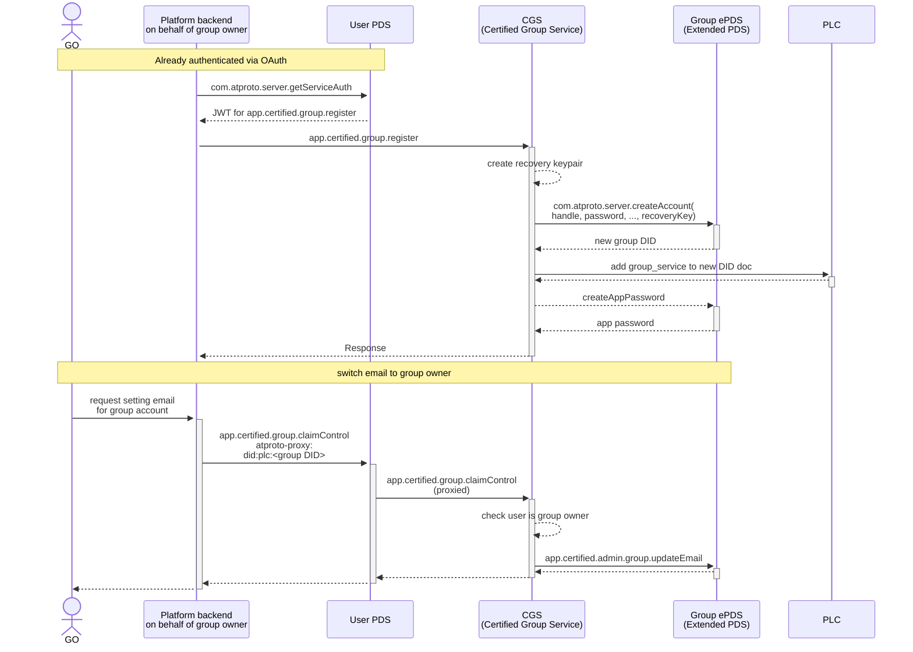

# Architecture

## System overview

The Certified Group Service (CGS) solves a specific problem in the AT Protocol ecosystem: **how can multiple users collaboratively manage a single atproto repository with access control?**

In standard atproto, each repository is controlled by a single identity (DID). CGS sits between clients and the group's PDS, acting as a governance layer that enforces who can do what. It manages membership, record authorship, API keys, pending ownership transfers, and audit data in its own SQLite databases, then proxies repository writes and blob uploads to the backing PDS using stored credentials.

Clients can call CGS directly or reach it through atproto service proxying:

```
Client ── direct JWT / X-API-Key ──▶ CGS ──▶ Group's PDS
   │                                  │
   └─ user's PDS + atproto-proxy ─────┘

CGS:
  1. AuthVerifier       (JWT, API key, or admin Basic auth)
  2. RbacChecker        (DID → group role)
  3. Scope gate         (API-key scopes, when applicable)
  4. PdsAgentPool       (stored group credentials)
  5. AuditLogger        (authorized operations and denials)
```

## Authentication flow

Authentication depends on the endpoint and credential type:

- **Service-level JWT methods** (`group.register`, `group.import`, and `groups.membership.list`) require `aud` equal to the service DID and do not target an existing group.
- **Group-scoped JWT methods** use the supported form of `aud` equal to the service DID plus an explicit `repo` group selector. Queries, raw-body methods, and bodyless procedures such as `app.certified.group.destroy` read `repo` from the querystring; JSON procedures with a body read it from the body. The deprecated form, where `aud` is the group DID and `repo` is omitted, remains accepted and receives deprecation headers.
- **API-key requests** use `X-API-Key` and require `repo` in the querystring, including for procedures. The key is looked up in the selected group's database before the body is parsed.
- **Operator admin methods** use HTTP Basic auth with `CGS_ADMIN_PASSWORD` and do not use group membership authentication.

For group-scoped JWT-authenticated requests, CGS:

1. **Parses the XRPC method** (NSID) from the request path and verifies the JWT `lxm` matches it.
2. **Verifies the JWT signature** against the issuer's DID document and checks expiration.
3. **Enforces token lifetime**: `exp - iat` must not exceed the 120-second nonce window.
4. **Checks the `jti` nonce** in `nonce_cache`; a reused token is rejected.
5. **Resolves the target group** from `repo` or, for legacy requests, the group-DID `aud`.
6. **Runs RBAC**, and for API keys also checks the key's scopes against the requested operation.
7. **Returns the authenticated caller and resolved group** to the endpoint handler. Service-level JWT methods return the caller without a group target.

## Service proxying

### Proxy targets

Clients may call CGS directly with a service-auth JWT or use the standard atproto proxy path through their own PDS. There are two proxy targets:

- `atproto-proxy: did:plc:GROUP#certified_group` resolves the group's DID document and uses the deprecated group-DID `aud` form.
- `atproto-proxy: did:web:SERVICE_HOST#certified_group_service` resolves CGS's own DID document and uses the supported service-DID `aud` form. The request must also include an explicit `repo` group selector.

For a proxied request, the user's PDS:

1. **Receives** the XRPC request with the `atproto-proxy` header.
2. **Resolves** the DID named by the proxy target through the AT Protocol DID resolution mechanism.
3. **Finds** the matching service entry in that DID document: `#certified_group` for the deprecated group-DID route, or `#certified_group_service` for the supported service-DID route.
4. **Creates** a service-auth JWT signed with the user's signing key (`iss` = user DID, `aud` = the proxy target's DID, `lxm` = NSID).
5. **Forwards** the request to the discovered group service endpoint with the JWT as a Bearer token.
6. **Returns** the group service's response to the client.

### DID document service entries

During `group.register`, CGS adds this service entry to the group's DID document via a PLC operation:

- **id**: `#certified_group`
- **type**: `CertifiedGroupService`
- **endpoint**: the service's public URL (`SERVICE_URL`)

CGS also serves its own `did:web` document at `/.well-known/did.json` with the `#certified_group_service` entry. Imported groups do not receive a DID-document update because CGS does not hold their rotation keys. A stale DID-document cache can temporarily hide the group service entry immediately after registration.

### Nonce cache

The `NonceCache` class manages replay prevention:

- Nonces are stored in the global SQLite database's `nonce_cache` table
- Each nonce has a 120-second TTL
- A cleanup timer runs every 60 seconds to purge expired entries
- The cleanup interval is configurable and properly stopped during graceful shutdown
- Token lifetime is enforced: JWTs where `exp - iat` exceeds 120 seconds are rejected, ensuring tokens cannot outlive the nonce replay window

## Authorization (RBAC)

### Role hierarchy

```
member (0) < admin (1) < owner (2)
```

Roles are compared numerically. A higher level grants all permissions of lower levels.

### Permission matrix

| Operation           | Minimum role | Description                                                  |
| ------------------- | ------------ | ------------------------------------------------------------ |
| `createRecord`      | member       | Create new records in the group repo                         |
| `uploadBlob`        | member       | Upload media/blobs                                           |
| `deleteOwnRecord`   | member       | Delete records you authored                                  |
| `putOwnRecord`      | member       | Edit records you authored                                    |
| `member.list`       | member       | List group members                                           |
| `putAnyRecord`      | admin        | Edit any member's records                                    |
| `deleteAnyRecord`   | admin        | Delete any member's records                                  |
| `putRecord:profile` | admin        | Edit the group's profile (`app.bsky.actor.profile` / `self`) |
| `member.add`        | admin        | Add new members                                              |
| `member.remove`     | admin        | Remove members (with restrictions)                           |
| `audit.query`       | admin        | Query the audit log                                          |
| `role.set`          | owner        | Change member roles                                          |
| `group.destroy`     | owner        | Remove the group from the service (account left intact)      |

### Special rules

- **Cannot modify equal or higher roles**: An admin cannot remove another admin; only owners can
- **Cannot assign roles above assignable set**: `member.add` only allows assigning `member` or `admin` — not `owner`
- **Self-removal succeeds for non-owners**: Any non-owner member can remove themselves regardless of role. The owner cannot self-remove — the `CannotRemoveOwner` guard fires before the self-removal path; transfer ownership away first.
- **Owner role is immutable**: `role.set` rejects both promoting a member to owner (`CannotPromoteToOwner`) and changing an existing owner's role (`CannotModifyOwner`); `member.remove` rejects removing an owner (`CannotRemoveOwner`). Each group has exactly one owner (initially the registrant). Ownership moves only through the dedicated two-phase [`ownershipTransfer.*`](api-reference.md#ownership-transfer) handshake (owner proposes, proposed member accepts) or the operator-only [`admin.setOwner`](api-reference.md#post-xrpcappcertifiedgroupadminsetowner) break-glass endpoint — never through `role.set`.
- **Author-based record ownership**: `putRecord` and `deleteRecord` check the `group_record_authors` table to determine if the caller authored the record, then select the appropriate operation (`putOwnRecord` / `putAnyRecord` vs `putRecord:profile`, `deleteOwnRecord` vs `deleteAnyRecord`). Members can only edit or delete their own records; editing or deleting another member's record requires admin.

### RBAC enforcement

The `RbacChecker` class provides two key methods:

- `assertCan(groupDb, memberDid, operation)` — looks up the member's role, compares against the operation's minimum role, and throws `UnauthorizedError` (not a member) or `ForbiddenError` (insufficient role) on failure. Returns the member's role on success.
- `isAuthor(groupDb, recordUri, memberDid)` — checks if a specific member authored a record.

### Concurrency model

The service runs on Node's single-threaded event loop with a **synchronous**
SQLite driver (`better-sqlite3`, configured in `src/db/sqlite.ts`). Every query
and every `raw.transaction(...)` runs to completion within one event-loop turn —
there is no `await` inside a transaction. **A request handler's database
statements therefore cannot interleave with another handler's mid-transaction;
the only points at which control passes between concurrent handlers are the
`await` boundaries _between_ database calls.**

This is load-bearing for several read-modify-write flows that are safe only
because whole transactions are indivisible. The clearest example is ownership
transfer: `admin.setOwner` invalidates a pending member-initiated proposal with
a `clear()` issued _after_ its `transferOwner` transaction commits (not inside
it), and a concurrent `ownershipTransfer.accept` in that gap still resolves
consistently because `accept` re-reads the current owner and `transferOwner` is
atomic. That argument holds only under a synchronous driver.

**If this ever moves to an asynchronous driver** (e.g. `node:sqlite` worker
threads, libsql, or a connection pool with genuine parallelism), every such
flow must be re-audited: statements could then interleave mid-transaction, and
the affected paths would need explicit locking or single-transaction
invalidation.

## Data model

### Global database (`global.sqlite`)

#### `groups`

| Column                   | Type            | Description                                                       |
| ------------------------ | --------------- | ----------------------------------------------------------------- |
| `did`                    | TEXT (PK)       | The group's DID                                                   |
| `pds_url`                | TEXT            | URL of the group's backing PDS                                    |
| `encrypted_app_password` | TEXT            | AES-256-GCM encrypted app password for PDS login                  |
| `encrypted_recovery_key` | TEXT (nullable) | AES-256-GCM encrypted recovery keypair for signing PLC operations |
| `created_at`             | TEXT            | ISO timestamp, defaults to current time                           |

#### `nonce_cache`

| Column       | Type      | Description          |
| ------------ | --------- | -------------------- |
| `jti`        | TEXT (PK) | JWT ID (nonce)       |
| `expires_at` | TEXT      | Expiration timestamp |

Indexed on `expires_at` for efficient cleanup.

#### `member_index`

A reverse index of group membership, populated whenever a member is added, removed, or has their role changed. It backs the cross-group `app.certified.groups.membership.list` endpoint (find every group a DID belongs to), which the per-group databases cannot answer since there is no reverse mapping from member to group.

| Column       | Type      | Description                                  |
| ------------ | --------- | -------------------------------------------- |
| `member_did` | TEXT (PK) | Member's DID (composite PK with `group_did`) |
| `group_did`  | TEXT (PK) | Group's DID (composite PK with `member_did`) |
| `role`       | TEXT      | The member's role in that group              |
| `added_by`   | TEXT      | DID of the member who added this person      |
| `added_at`   | TEXT      | ISO timestamp                                |

Indexed on `group_did`.

### Per-group databases (`data/groups/{hash}.sqlite`)

Each group gets its own SQLite database, named by the SHA-256 hash of the group DID. This provides isolation between groups.

#### `group_members`

| Column       | Type      | Description                             |
| ------------ | --------- | --------------------------------------- |
| `member_did` | TEXT (PK) | Member's DID                            |
| `role`       | TEXT      | `member`, `admin`, or `owner`           |
| `added_by`   | TEXT      | DID of the member who added this person |
| `added_at`   | TEXT      | ISO timestamp                           |

Composite index on `(added_at, member_did)` for efficient paginated listing.

#### `group_record_authors`

| Column       | Type      | Description                      |
| ------------ | --------- | -------------------------------- |
| `record_uri` | TEXT (PK) | AT URI of the record             |
| `author_did` | TEXT      | DID of the member who created it |
| `collection` | TEXT      | Collection NSID                  |
| `created_at` | TEXT      | ISO timestamp                    |

Indexed on `author_did` for authorship lookups.

#### `group_audit_log`

| Column       | Type               | Description                                        |
| ------------ | ------------------ | -------------------------------------------------- |
| `id`         | INTEGER (PK, auto) | Sequential entry ID                                |
| `actor_did`  | TEXT               | DID of the person who performed the action         |
| `action`     | TEXT               | Operation name (e.g. `createRecord`, `member.add`) |
| `collection` | TEXT               | Collection NSID (for record operations)            |
| `rkey`       | TEXT               | Record key (for record operations)                 |
| `result`     | TEXT               | `permitted` or `denied`                            |
| `detail`     | TEXT               | JSON-encoded additional context                    |
| `jti`        | TEXT               | JWT ID for request tracing                         |
| `created_at` | TEXT               | ISO timestamp                                      |

Indexed on `created_at`, `actor_did`, `action`, and `collection` for efficient querying.

#### `group_api_keys`

Stores hashed, long-lived API keys issued by group members. The plaintext key is returned only at creation time.

| Column         | Description                           |
| -------------- | ------------------------------------- |
| `key_ref`      | Non-secret key identifier             |
| `key_hash`     | SHA-256 hash of the key secret        |
| `name`         | Member-supplied label                 |
| `scopes`       | JSON array of canonical scope strings |
| `created_by`   | DID of the issuing member             |
| `created_at`   | Creation timestamp                    |
| `last_used_at` | Best-effort last-use timestamp        |
| `revoked_at`   | Nullable soft-revocation timestamp    |

#### `pending_ownership_transfer`

A single-row table holding the current pending ownership proposal. Expiry is lazy: expired rows are treated as absent when read, and no sweeper is required.

| Column          | Description                                |
| --------------- | ------------------------------------------ |
| `proposer_did`  | DID of the owner who proposed the transfer |
| `recipient_did` | DID of the proposed new owner              |
| `created_at`    | Proposal creation timestamp                |
| `expires_at`    | Proposal expiry timestamp                  |

## PDS proxy layer

### Agent pool

The `PdsAgentPool` manages authenticated connections to each group's PDS:

1. **Lookup**: When a request targets a group, the pool checks its cache for an existing agent
2. **Credential decryption**: If no cached agent exists, the group's `encrypted_app_password` is decrypted from the database using the master encryption key
3. **Login**: An `AtpAgent` is created and logs in with the group's DID and decrypted app password
4. **Caching**: The authenticated agent is cached for subsequent requests
5. **Auto-retry**: The `withAgent()` method wraps operations and automatically retries on `AuthenticationRequired` or `ExpiredToken` errors by invalidating the cache and re-authenticating

### Credential encryption

App passwords are encrypted at rest using **AES-256-GCM**:

- **Key**: 32-byte master key from the `ENCRYPTION_KEY` environment variable
- **IV**: 12 random bytes generated per encryption
- **Auth tag**: 16 bytes for integrity verification
- **Storage format**: Base64 encoding of `IV || AuthTag || Ciphertext`

### Blob handling

The `uploadBlob` endpoint accepts the raw request stream and buffers the complete blob in memory before forwarding it to the group's PDS. The XRPC server enforces `MAX_BLOB_SIZE`; the handler then sends the resulting `Buffer` upstream. This is not a streaming transfer to the PDS.

## Audit logging

The `AuditLogger` records every meaningful action in the per-group `group_audit_log` table.

### What gets logged

- All record operations (create, put, delete) — both permitted and denied
- Blob uploads
- Member management (add, remove)
- Role changes
- Ownership-transfer operations and operator ownership reassignment
- API-key creation and revocation, plus denied key-management attempts
- RBAC denials (with the reason for denial)

### Entry structure

Each log entry captures:

- **Who**: `actor_did` — the DID of the person performing the action
- **What**: `action` — the operation name
- **Where**: `collection` and `rkey` — for record-level operations
- **Result**: `permitted` or `denied`
- **Detail**: JSON object with additional context (e.g. `{ memberDid, role }` for member operations, `{ reason }` for denials)
- **Tracing**: `jti` — the JWT ID for correlating with auth logs
- **When**: `created_at` — ISO timestamp

## Group lifecycle

### Registration and control claim flow



1. **Registration**: `group.register` requires a service auth JWT proving the caller controls the `ownerDid`. It then creates a PDS account, generates a recovery keypair (used to sign PLC operations directly instead of relying on the PDS's `signPlcOperation` endpoint), registers a `#certified_group` service endpoint in the group's DID document, stores encrypted credentials and the encrypted recovery key, and seeds the owner.
2. **Database creation**: On startup, CGS loads all groups from the registry and runs per-group migrations for each, creating the group's SQLite database if it doesn't exist.
3. **First owner**: The first owner is automatically seeded into the group's `group_members` table during `group.register`. After that, the owner can manage the group through the API.
4. **Ongoing management**: Owners can promote admins, admins can add/remove members, and all authorized members can interact with the group's repository.

### Import

`group.import` promotes an **existing** PDS account into a group instead of creating one. It shares register's tail (store encrypted credentials, run migrations, seed the owner) but differs at the front:

- The JWT must be signed by the account being imported (`iss` = `groupDid`), not by the prospective owner — the account authorises its own promotion, which an app password alone cannot do (see [Authentication flow](#authentication-flow) and `docs/design/group-import.md`).
- The caller supplies an app password rather than CGS minting one; it is stored encrypted exactly as for registered groups.
- CGS resolves the account's PDS and handle from its DID document (the account may live on a PDS other than `GROUP_PDS_URL`), so the per-group `pds_url` is whatever the DID document advertises.
- No recovery keypair is generated and **no DID-document change is made** — an app password cannot perform PLC operations, and CGS never had genesis control. `encrypted_recovery_key` is left `NULL`, which is how imported groups are distinguished from registered ones in the `groups` table.

### Destroy

`group.destroy` is the service-level inverse: an owner removes the group **from the service** while leaving the underlying PDS account intact (it is not account deletion). It deletes the group's `groups` row and `member_index` entries in a single global-DB transaction, then unlinks the per-group SQLite file; doing the file unlink only after the transaction commits means an interrupted destroy leaves at worst an orphaned file rather than inconsistent global state. Because the per-group audit log is deleted with it, the destroy is recorded in the service's operational log instead.

Destroy is lossy: the per-group DB — including the `group_record_authors` table and the audit log — is gone. The account can be re-imported afterward, but the re-imported group has an empty authorship table, so surviving PDS records are treated as unowned and a member can claim authorship by `putRecord`ing a known `rkey` (see `putRecord.ts`: no author row ⇒ `createRecord`, which members may perform). Destroy also leaves the `certified_group` DID-document entry (for `register`ed groups) and the PDS app password in place — the service cannot revoke either. These are the DID/account controller's responsibility. User-facing consequences are spelled out in [api-reference.md](./api-reference.md#post-xrpcappcertifiedgroupdestroy).

## Startup sequence

1. Load and validate configuration via Zod
2. Create structured logger (pino)
3. Ensure `DATA_DIR` exists
4. Open global SQLite database and run global migrations
5. Initialize the per-group database pool
6. Create the DID resolver (`IdResolver` from `@atproto/identity`)
7. Load all managed groups and run per-group migrations
8. Initialize auth (AuthVerifier, NonceCache with 60s cleanup interval)
9. Initialize RBAC checker
10. Create Express app with middleware:
    - `trust proxy = 1`
    - pino-http request logging
    - JSON body parser (skipped for `uploadBlob`)
    - `/health` endpoint
    - All XRPC route handlers
    - XRPC error handler
11. Start listening on configured port
12. Register graceful shutdown handlers (SIGTERM, SIGINT):
    - Stop accepting connections
    - Destroy keep-alive sockets
    - Close server
    - Close all group databases
    - Close global database
